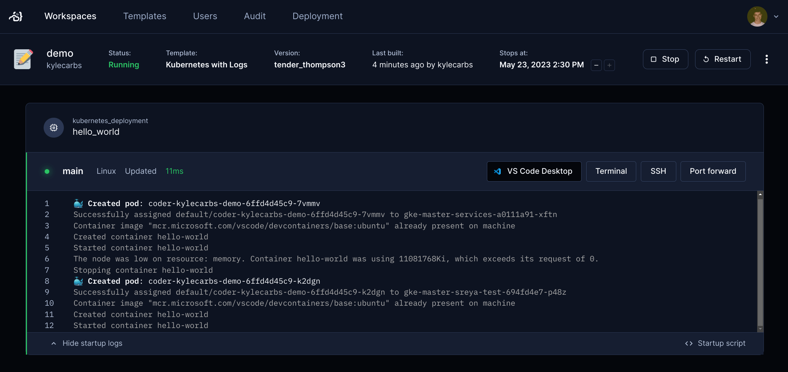

# coder-logstream-kube

[](https://discord.gg/coder)
[](https://github.com/coder/envbuilder/pkgs/container/coder-logstream-kube)
[](https://pkg.go.dev/github.com/coder/coder-logstream-kube)
[](./LICENSE)

Stream Kubernetes Pod events to the Coder startup logs.

- Easily determine the reason for a pod provision failure, or why a pod is stuck in a pending state.
- Visibility into when pods are OOMKilled, or when they are evicted.
- Filter by namespace, field selector, and label selector to reduce Kubernetes API load.



## Usage

Apply the Helm chart to start streaming logs into your Coder instance:

```console
helm repo add coder-logstream-kube https://helm.coder.com/logstream-kube
helm install coder-logstream-kube coder-logstream-kube/coder-logstream-kube \
    --namespace coder \
    --set url=<your-coder-url>
```

> **Note**
> For additional customization (like customizing the image, pull secrets, annotations, etc.), you can use the
> [values.yaml](https://github.com/coder/coder-logstream-kube/blob/main/values.yaml) file directly.

Ensure your Coder template is using a `kubernetes_deployment` resource with the `wait_for_rollout` property set to false.

```hcl
resource "kubernetes_deployment" "hello_world" {
  wait_for_rollout = false
  ...
}
```

This will ensure all pod events will be sent during initialization and startup.
